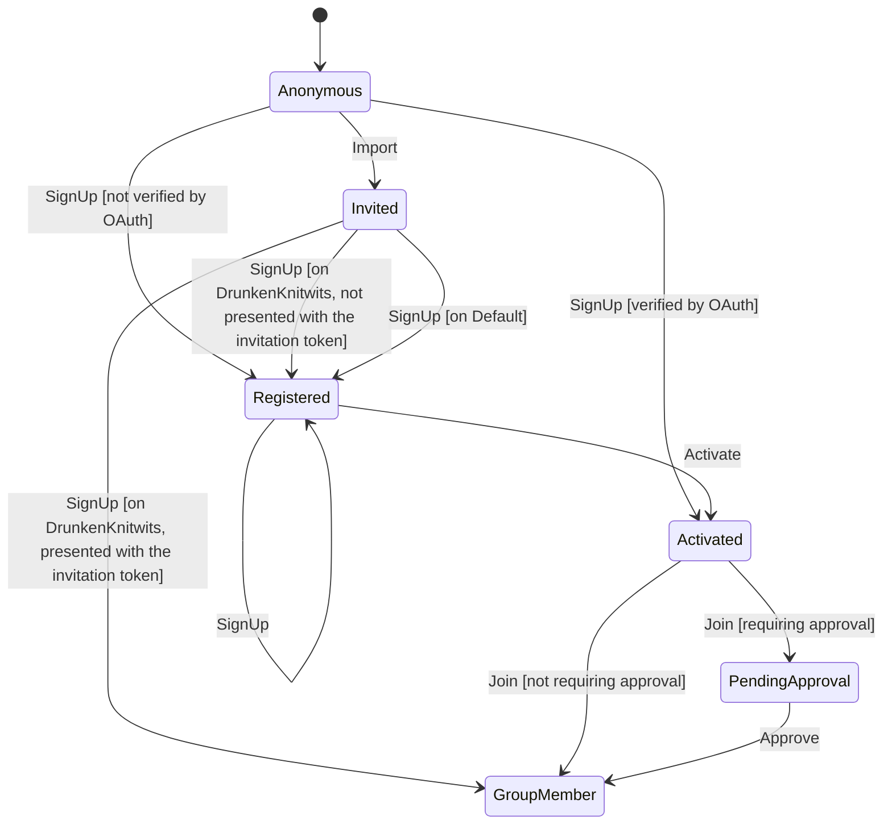

# Account creation

Generated from the state machine definition. Do not edit by hand - run the tests to regenerate it.

## Transitions

| From | Trigger | To | When | Steps |
| --- | --- | --- | --- | --- |
| Anonymous | Import | Invited | - | - |
| Anonymous | SignUp | Registered | not verified by OAuth | - |
| Anonymous | SignUp | Activated | verified by OAuth | - |
| Registered | SignUp | Registered | - | - |
| Invited | SignUp | GroupMember | on DrunkenKnitwits, presented with the invitation token | - |
| Invited | SignUp | Registered | on DrunkenKnitwits, not presented with the invitation token | - |
| Invited | SignUp | Registered | on Default | - |
| Registered | Activate | Activated | - | - |
| Activated | Join | PendingApproval | requiring approval | - |
| Activated | Join | GroupMember | not requiring approval | - |
| PendingApproval | Approve | GroupMember | - | - |
