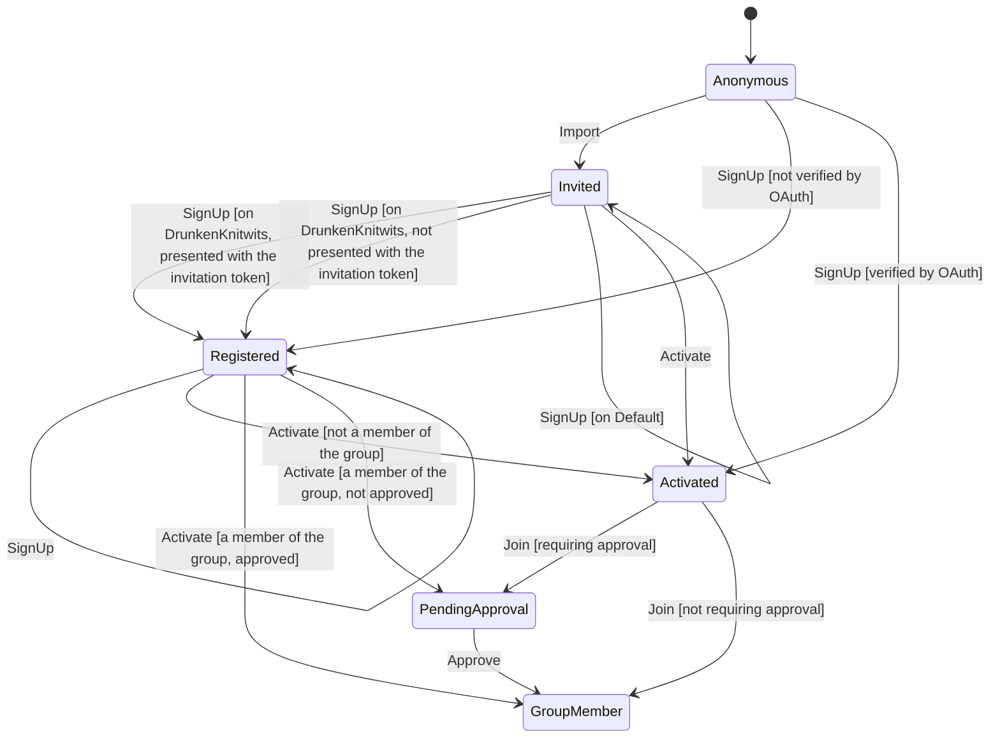

# Account creation

Generated from the state machine definition. Do not edit by hand - run the tests to regenerate it.

## Transitions

| From | Trigger | To | When | Steps |
| --- | --- | --- | --- | --- |
| Anonymous | Import | Invited | - | - |
| Anonymous | SignUp | Registered | not verified by OAuth | - |
| Anonymous | SignUp | Activated | verified by OAuth | - |
| Registered | SignUp | Registered | - | - |
| Invited | SignUp | Registered | on DrunkenKnitwits, presented with the invitation token | - |
| Invited | SignUp | Registered | on DrunkenKnitwits, not presented with the invitation token | - |
| Invited | SignUp | Invited | on Default | - |
| Invited | Activate | Activated | - | - |
| Registered | Activate | Activated | not a member of the group | - |
| Registered | Activate | GroupMember | a member of the group, approved | - |
| Registered | Activate | PendingApproval | a member of the group, not approved | - |
| Activated | Join | PendingApproval | requiring approval | 1. checks the group has room for another member (Decision) 2. checks the group's required questions are answered (Decision) 3. adds the member to the group (Write) 4. consumes the invitation (Write) 5. notifies the group's admins in the app (Write) 6. commits the changes (Commit) 7. emails the group's admins (ExternalEffect) |
| Activated | Join | GroupMember | not requiring approval | 1. checks the group has room for another member (Decision) 2. checks the group's required questions are answered (Decision) 3. adds the member to the group (Write) 4. consumes the invitation (Write) 5. notifies the group's admins in the app (Write) 6. commits the changes (Commit) 7. emails the group's admins (ExternalEffect) |
| PendingApproval | Approve | GroupMember | - | - |
