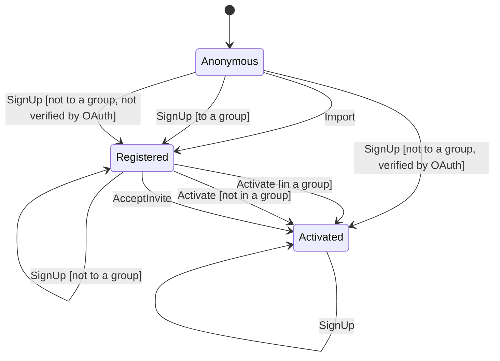

# Account

Generated from the state machine definition. Do not edit by hand - run the tests to regenerate it.

## Transitions

| From | Trigger | To | When | Steps |
| --- | --- | --- | --- | --- |
| Anonymous | Import | Registered | - | 1. raises an account for the imported address (Write) |
| Anonymous | SignUp | Registered | to a group | 1. checks the group has room for another member (Decision) 2. checks the group's required questions and the email address (Decision) 3. checks the submitted picture is an image (Decision) 4. creates the account (Write) 5. applies the email opt-in choice (Write) 6. stores the member's locale (Write) 7. joins the group (Write) 8. places the member where the group is (Write) 9. puts the account on the default site subscription (Write) 10. stores the member's picture (Write) 11. issues the activation token (Write) 12. re-raises invitations to other groups (Write) 13. commits the sign-up (Commit) 14. emails the activation link (ExternalEffect) |
| Anonymous | SignUp | Registered | not to a group, not verified by OAuth | 1. checks the email address (Decision) 2. creates the account, and places it from the submitted location (Write) 3. puts the account on the default site subscription (Write) 4. records the member's interests (Write) 5. re-raises invitations to other groups (Write) 6. issues the activation token (Write) 7. commits the sign-up (Commit) 8. creates the interests the member typed in (ExternalEffect) 9. emails the activation link (ExternalEffect) |
| Anonymous | SignUp | Activated | not to a group, verified by OAuth | 1. checks the email address (Decision) 2. creates the account, and places it from the submitted location (Write) 3. puts the account on the default site subscription (Write) 4. records the member's interests (Write) 5. re-raises invitations to other groups (Write) 6. marks the account activated (Write) 7. commits the sign-up (Commit) 8. creates the interests the member typed in (ExternalEffect) 9. emails a welcome (ExternalEffect) |
| Registered | SignUp | Registered | to a group, presented with the invitation token | 1. checks the group has room for another member (Decision) 2. checks the group's required questions and the email address (Decision) 3. checks the submitted picture is an image (Decision) 4. discards the unactivated account being replaced (Write) 5. commits the changes (Commit) 6. creates the account (Write) 7. applies the email opt-in choice (Write) 8. stores the member's locale (Write) 9. joins the group (Write) 10. places the member where the group is (Write) 11. puts the account on the default site subscription (Write) 12. stores the member's picture (Write) 13. issues the activation token (Write) 14. re-raises invitations to other groups (Write) 15. commits the sign-up (Commit) |
| Registered | SignUp | Registered | to a group, not presented with the invitation token | 1. checks the group has room for another member (Decision) 2. checks the group's required questions and the email address (Decision) 3. checks the submitted picture is an image (Decision) 4. discards the unactivated account being replaced (Write) 5. commits the changes (Commit) 6. creates the account (Write) 7. applies the email opt-in choice (Write) 8. stores the member's locale (Write) 9. joins the group (Write) 10. places the member where the group is (Write) 11. puts the account on the default site subscription (Write) 12. stores the member's picture (Write) 13. issues the activation token (Write) 14. re-raises invitations to other groups (Write) 15. commits the sign-up (Commit) 16. emails the activation link (ExternalEffect) |
| Registered | SignUp | Registered | not to a group | 1. checks the email address (Decision) 2. discards the unactivated account being replaced (Write) 3. commits the changes (Commit) 4. creates the account, and places it from the submitted location (Write) 5. puts the account on the default site subscription (Write) 6. records the member's interests (Write) 7. re-raises invitations to other groups (Write) 8. issues the activation token (Write) 9. commits the sign-up (Commit) 10. creates the interests the member typed in (ExternalEffect) 11. emails the activation link (ExternalEffect) |
| Activated | SignUp | Activated | - | 1. emails the address to say it already has an account (ExternalEffect) |
| Registered | Activate | Activated | in a group | 1. checks the password is allowed (Decision) 2. marks the account activated (Write) 3. stores the password (Write) 4. spends the activation link (Write) 5. notifies the group of a new member (Write) 6. commits the changes (Commit) 7. emails the group about its new member (ExternalEffect) |
| Registered | Activate | Activated | not in a group | 1. checks the password is allowed (Decision) 2. marks the account activated (Write) 3. stores the password (Write) 4. spends the activation link (Write) 5. commits the changes (Commit) 6. emails a welcome (ExternalEffect) |
| Registered | AcceptInvite | Activated | - | 1. checks the password is allowed (Decision) 2. marks the account activated (Write) 3. stores the password (Write) 4. spends the activation link (Write) 5. records the name the member confirmed (Write) 6. joins the group the invitation was to (Write) 7. commits the changes (Commit) 8. emails the group about its new member (ExternalEffect) |
