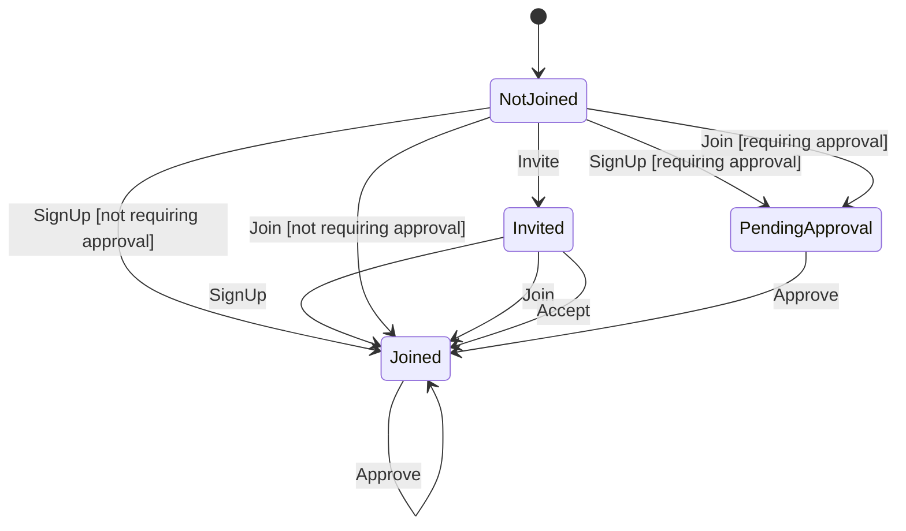

# Chapter membership

Generated from the state machine definition. Do not edit by hand - run the tests to regenerate it.

## Transitions

| From | Trigger | To | When | Steps |
| --- | --- | --- | --- | --- |
| NotJoined | Invite | Invited | - | 1. asks the member to join (Write) |
| NotJoined | SignUp | PendingApproval | requiring approval | 1. adds the member to the group (Write) |
| NotJoined | SignUp | Joined | not requiring approval | 1. adds the member to the group (Write) |
| Invited | SignUp | Joined | - | 1. adds the member to the group (Write) |
| NotJoined | Join | PendingApproval | requiring approval | 1. checks the group has room for another member (Decision) 2. checks the group's required questions are answered (Decision) 3. adds the member to the group (Write) 4. consumes the invitation (Write) 5. notifies the group's admins in the app (Write) 6. commits the changes (Commit) 7. emails the group's admins (ExternalEffect) |
| NotJoined | Join | Joined | not requiring approval | 1. checks the group has room for another member (Decision) 2. checks the group's required questions are answered (Decision) 3. adds the member to the group (Write) 4. consumes the invitation (Write) 5. notifies the group's admins in the app (Write) 6. commits the changes (Commit) 7. emails the group's admins (ExternalEffect) |
| Invited | Join | Joined | - | 1. checks the group has room for another member (Decision) 2. checks the group's required questions are answered (Decision) 3. adds the member to the group (Write) 4. consumes the invitation (Write) 5. notifies the group's admins in the app (Write) 6. commits the changes (Commit) 7. emails the group's admins (ExternalEffect) |
| Invited | Accept | Joined | - | 1. checks the group has room for another member (Decision) 2. checks the group's required questions are answered (Decision) 3. adds the member to the group (Write) 4. consumes the invitation (Write) 5. notifies the group's admins in the app (Write) |
| PendingApproval | Approve | Joined | - | 1. records the member as approved (Write) 2. commits the changes (Commit) 3. tells the member they are approved (ExternalEffect) |
| Joined | Approve | Joined | - | - |
