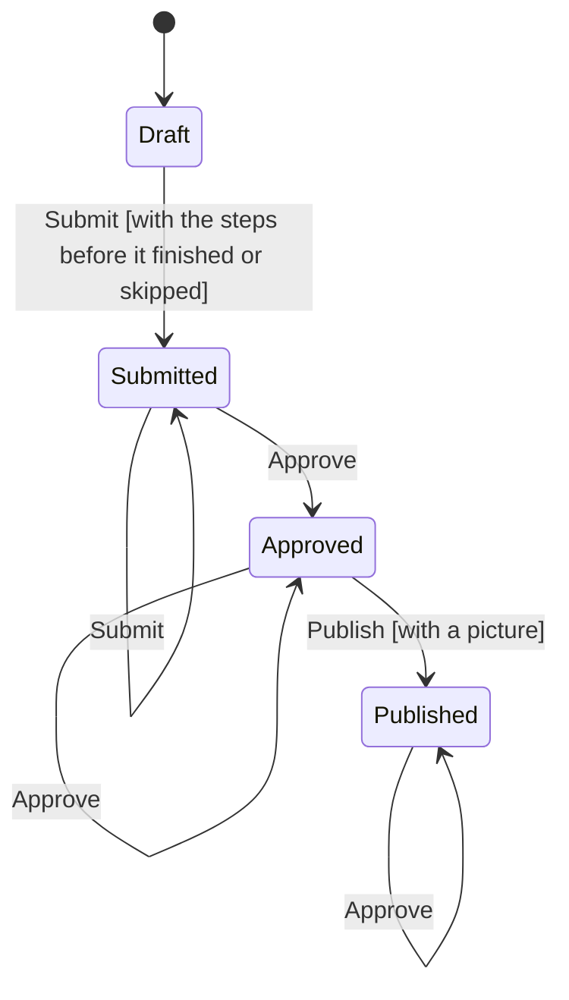

# Chapter publication

Generated from the state machine definition. Do not edit by hand - run the tests to regenerate it.

## Transitions

| From | Trigger | To | When | Steps |
| --- | --- | --- | --- | --- |
| Draft | Submit | Submitted | with the steps before it finished or skipped | 1. records the group as submitted (Write) 2. commits the changes (Commit) 3. tells site admins it is waiting on them (ExternalEffect) |
| Submitted | Submit | Submitted | - | - |
| Approved | Submit | Approved | - | - |
| Published | Submit | Published | - | - |
| Submitted | Approve | Approved | - | 1. records the group as approved (Write) 2. commits the changes (Commit) 3. tells the owner it is approved (ExternalEffect) |
| Approved | Approve | Approved | - | - |
| Published | Approve | Published | - | - |
| Approved | Publish | Published | with a picture | 1. records the group as published (Write) 2. commits the changes (Commit) 3. tells the owner it is holding invites (ExternalEffect) |
